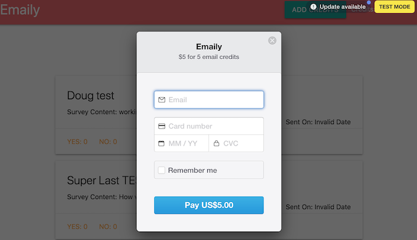
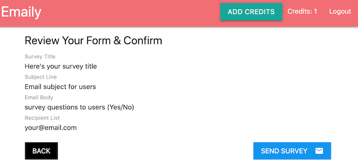

# Emaily - feedback collection app 📧
> Emaily is a large feedback-collection app that profiles the advanced features of React, Redux, Express, and Mongo. This mega app will include the full gamut of features, including everything from authentication to email handling. It can handle sending emails to a big list of users for the purpose of collecting feedback.

## Table of contents
* [General info](#general-info)
* [Screenshots](#screenshots)
* [Technologies](#technologies)
* [Setup](#setup)
* [Features](#features)
* [Status](#status)
* [Inspiration](#inspiration)
* [Contact](#contact)

## General info
This full stack web application project is to practice modern technologies using Node.js with React. You can add credits, create survey and send to emails. 

Find Heroku deployed version here: https://fathomless-island-66385.herokuapp.com

##### 🔑 To test the app 
**test card No. 4242 4242 4242 4242**
(other else data can be filled with any valid type (fake) as your own. )

## Screenshots

## Tech Stack
* Node.js - v14.15.4 
* React - v17.0.1
* Express - v4.17.1
* Redux - v4.0.5
* MongoDB mongoose - v5.12.0
* etc. Thunk, redux-form, Google OAuth, Stripe, Sendgrid, Ngrok 

## Setup
Clone this repo to your desktop and run `npm install` to install all the dependencies.
You might want to look into `config.json` to make change the port you want to use.

Development Keys: The CLIENT_ID and CLIENT_SECRET in `config/dev.js` are for development purposes and do not represent the actual application keys. Feel free to use them or use a new set of keys by creating an OAuth application of your own. 
###### List of keys you need:

- googleClientID
- googleClientSecret
- mongoURI
 (https://www.mongodb.com/cloud/atlas)
- cookieKey 
-- create your own combination randomly
- stripePublishableKey
- stripeSecretKey
- sendGridKey
- redirectDomain 
(https://console.cloud.google.com)

To run on your local device, `npm run dev`

## Features
Things you can do with Emaily. This is built with advanced featured 
* Login/Logout with Google OAuth
* Add credits using Stripe
* Create & send Surveys to a big list of emails
* Overview your Survey history on Dashboard
* Users can vote in their emails
* Track client's votes on your dashboard

###### To-do list:
* Improve client side design
* Allow users to delete surveys that have been created.
* Allow users to specify the 'form' field on survey emails
* Allow client side sorting of surveys
* Allow surveys to create in 'draft mode'

## Status
Project is:  _finished_ on its initial purpose. But there will be update for To-do list with time 🙌

## Inspiration
This project is inspired/motivated by a full stack web development course with Stephen Grider on Udemy. I followed all his lectures and steps to complete this huge app!

## Contact
Created by [@alizebreezes](https://github.com/alizebreezes) - feel free to contact me!
